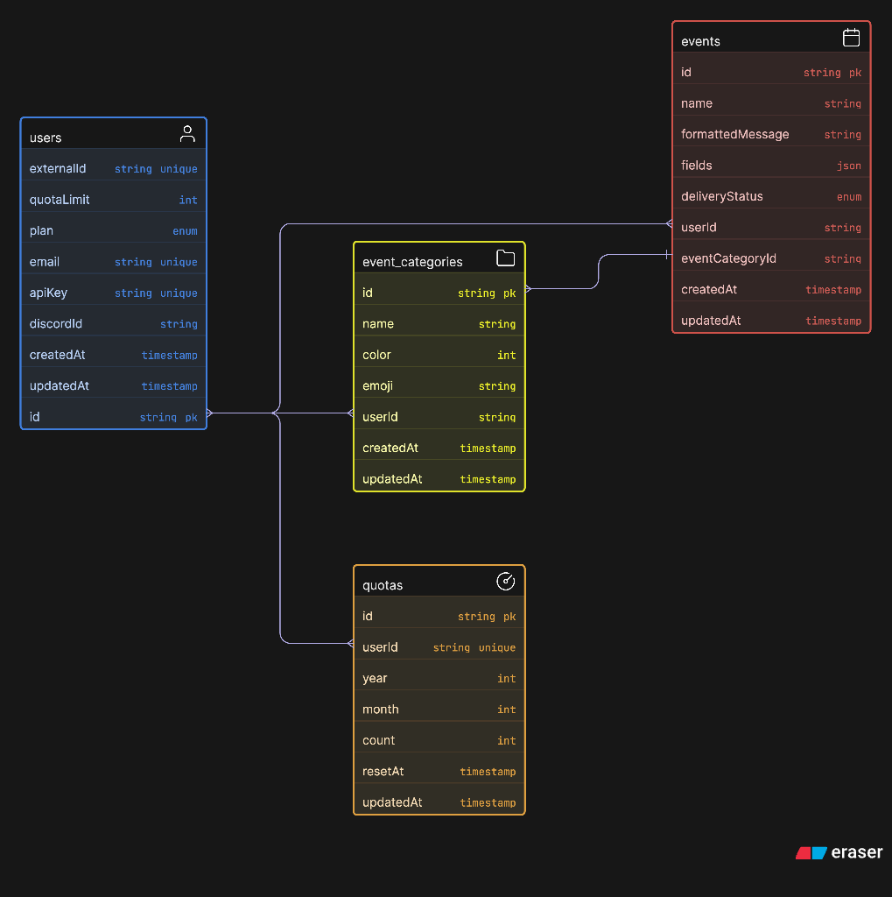

### Project Overview

Welcome to Ping panda, a cutting-edge platform that combines Stripe payment processing with Discord API integration. This project aims to provide a seamless user experience for users and administrators alike.

### Features

- Complete SaaS built in modern Next.js
- Beautiful landing page included
- Custom artworks made by a professional illustrator
- Real-time event messages via Discord
- Clean & intuitive event monitoring dashboard
- Secure payments using Stripe
- Customers can purchase your PRO plan
- Clean, modern UI on top of shadcn-ui
- Authentication using Clerk
- 100% written in TypeScript

### Database Schema

### Technologies Used

- Next.js
- Prisma (database ORM)
- Node.js
- TypeScript
- Stripe API
- postgresql
- Discord API
- Tailwind CSS

### Installation and Setup

1. Install dependencies using npm or yarn: `npm install` or `yarn install`
2. Configure environment variables (e.g., API keys, database connections) in your `.env` file
3. Run the development server: `npm run dev` or `yarn dev`
4. Build the application: `npm run build` or `yarn build`